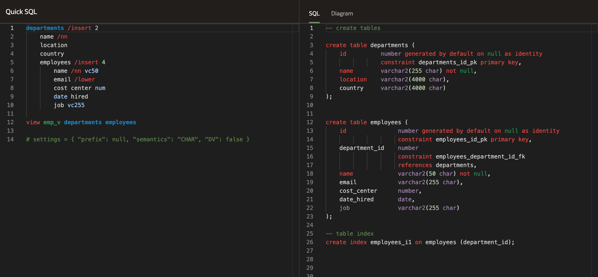
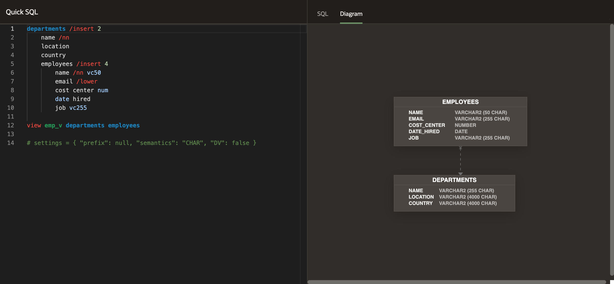
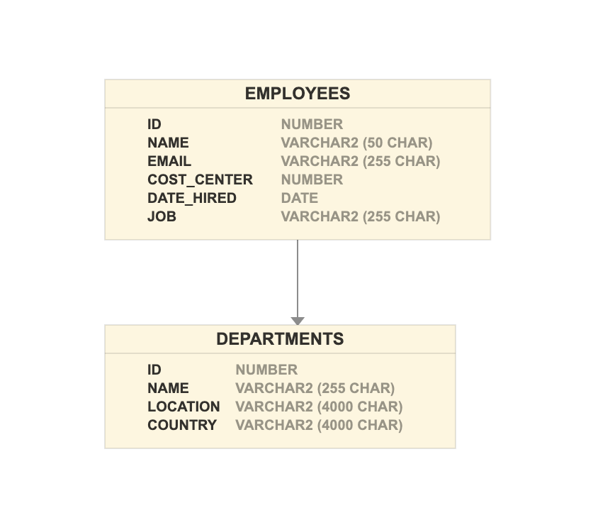
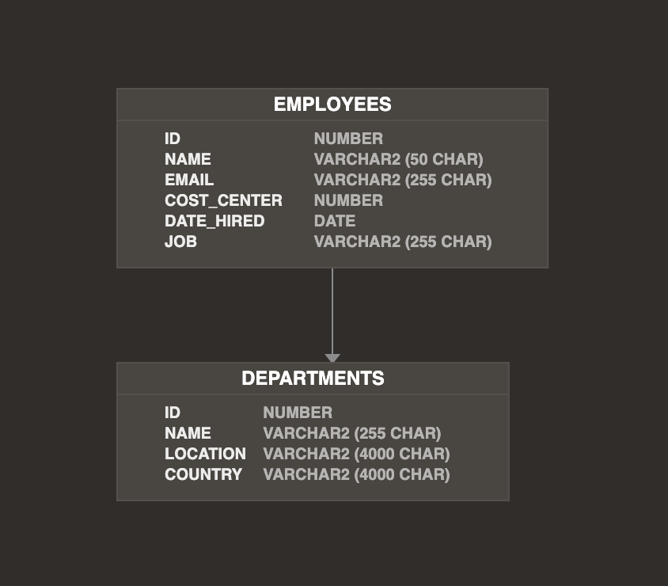

# Quick SQL <!-- omit in toc -->

## Table of Contents <!-- omit in toc -->

- [Overview](#overview)
- [Translating Quick SQL into Oracle SQL Data Definition Language (DDL)](#translating-quick-sql-into-oracle-sql-data-definition-language-ddl)
    - [DDL NodeJS ECMA Script Module (ESM) Example](#ddl-nodejs-ecma-script-module-esm-example)
    - [DDL NodeJS Common JS (CJS) Example](#ddl-nodejs-common-js-cjs-example)
    - [DDL Browser ECMA Script Module (ESM) Example](#ddl-browser-ecma-script-module-esm-example)
    - [DDL Browser Universal Module Definition (UMD) Example](#ddl-browser-universal-module-definition-umd-example)
- [Transforming Quick SQL into an Entity-Relationship Diagram (ERD)](#transforming-quick-sql-into-an-entity-relationship-diagram-erd)
    - [Prerequisites](#prerequisites)
    - [ERD Browser ESM Example](#erd-browser-esm-example)
    - [ERD Browser UMD Example](#erd-browser-umd-example)
    - [ERD Theming](#erd-theming)

## Overview

Quick SQL (QSQL) is a markdown-like shorthand syntax that expands to standards-based
Oracle SQL. It is useful to rapidly design and prototype data models. Take a
look at the example below:



Previously, Quick SQL was only available within Oracle Application Express. This
project reimplements the QSQL parser and translator into a JavaScript
library which can be used in both NodeJS and the browser.

This repository also includes a QSQL to Entity Relationship Diagram
module that can be used as seen in the example below:



## Translating QSQL into Oracle SQL Data Definition Language (DDL)

The QSQL to DDL translator is the product's core component, It allows users
to transform a QSQL string into an Oracle SQL string.

The Quick SQL Syntax is documented [here](./Quick-SQL-Grammar.pdf)

See below for examples of how to use this library.

### DDL NodeJS ECMA Script Module (ESM) Example

```js
import quickSQL from "./dist/quick-sql.js";
import fs from "fs";

try {
    const text = fs.readFileSync( './test/department_employees.quicksql' );
    console.log( quickSQL.toDDL( text.toString() ) );
} catch( e ) {
    console.error( e );
};
```

### DDL NodeJS Common JS (CJS) Example

```js
const quickSQL  = require( "./dist/quick-sql.umd.cjs" );
const fs = require( "fs" );

try {
    const text = fs.readFileSync( './test/department_employees.quicksql' );
    console.log( quickSQL.toDDL( text.toString() ) );
} catch( e ) {
    console.error( e );
};
```

### DDL Browser ECMA Script Module (ESM) Example

```html
<script type="module">
    import quickSQL from './dist/quick-sql.js';
    document.body.innerText = quickSQL.toDDL(
`departments /insert 2
    name /nn
    location
    country
    employees /insert 4
        name /nn vc50
        email /lower
        cost center num
        date hired
        job vc255

view emp_v departments employees

# settings = { "prefix": null, "semantics": "CHAR", "DV": false }

`
    );
</script>
```

### DDL Browser Universal Module Definition (UMD) Example

```html
<script src="./dist/quick-sql.umd.cjs"></script>
<script>
    document.body.innerText = quickSQL.toDDL(
`departments /insert 2
    name /nn
    location
    country
    employees /insert 4
        name /nn vc50
        email /lower
        cost center num
        date hired
        job vc255

view emp_v departments employees

# settings = { "prefix": null, "semantics": "CHAR", "DV": false }

`
    );
</script>
```

## Transforming Quick SQL into an Entity-Relationship Diagram (ERD)

### Prerequisites

You need to add the following dependencies to your HTML:

- JointJS+ v3.5.0 (Requires a paid License). This requires the following
    dependencies (See the [JointJS+
    Documentation](https://resources.jointjs.com/docs/rappid/v3.5/index.html)):

    - jQuery
    - lodash
    - Backbone JS

### ERD Browser ESM Example

<!-- markdownlint-disable MD013 -->
```html
<!DOCTYPE html>
<html>
    <head>
        <meta charset="UTF-8">
        <meta name="viewport" content="width=device-width, initial-scale=1.0">
        <title>Quick ERD</title>

        <!-- Assuming you put the rappid.css file in this path -->
        <link rel="stylesheet" type="text/css" href="./examples/diagram-generator/libs/rappid.css">
        <link rel="stylesheet" href="./dist/quick-erd.css">

        <style>
            html, body {
                height: 100%;
                margin: 0;
            }
            #quickERD {
                width: 100%;
                height: 100%;
            }
        </style>
    </head>
    <body>
        <div id="quickERD"></div>

        <script src="https://cdn.jsdelivr.net/npm/jquery@3.7.1/dist/jquery.min.js" integrity="sha256-/JqT3SQfawRcv/BIHPThkBvs0OEvtFFmqPF/lYI/Cxo=" crossorigin="anonymous"></script>
        <script src="https://cdn.jsdelivr.net/npm/lodash@4.17.21/lodash.min.js" integrity="sha256-qXBd/EfAdjOA2FGrGAG+b3YBn2tn5A6bhz+LSgYD96k=" crossorigin="anonymous"></script>
        <script src="https://cdn.jsdelivr.net/npm/backbone@1.5.0/backbone-min.min.js"></script>

        <!-- Assuming you put the rappid.min.js file in this path -->
        <script src="./examples/diagram-generator/libs/rappid.min.js"></script>

        <script type="module">
            import { toERD } from './dist/quick-sql.js';
            import { Diagram  } from './dist/quick-erd.js';

            new Diagram( toERD(
`departments /insert 2
    name /nn
    location
    country
    employees /insert 4
        name /nn vc50
        email /lower
        cost center num
        date hired
        job vc255

view emp_v departments employees

# settings = { "prefix": null, "semantics": "CHAR", "DV": false }

`
            ), document.getElementById( 'quickERD' ) );
        </script>
    </body>
</html>
```
<!-- markdownlint-enable MD013 -->

### ERD Browser UMD Example

<!-- markdownlint-disable MD013 -->
```html
<!DOCTYPE html>
<html>
    <head>
        <meta charset="UTF-8">
        <meta name="viewport" content="width=device-width, initial-scale=1.0">
        <title>Quick ERD</title>

        <!-- Assuming you put the rappid.css file in this path -->
        <link rel="stylesheet" type="text/css" href="./examples/diagram-generator/libs/rappid.css">
        <link rel="stylesheet" href="./dist/quick-erd.css">

        <style>
            html, body {
                height: 100%;
                margin: 0;
            }
            #quickERD {
                width: 100%;
                height: 100%;
            }
        </style>
    </head>
    <body>
        <div id="quickERD"></div>

        <script src="https://cdn.jsdelivr.net/npm/jquery@3.7.1/dist/jquery.min.js" integrity="sha256-/JqT3SQfawRcv/BIHPThkBvs0OEvtFFmqPF/lYI/Cxo=" crossorigin="anonymous"></script>
        <script src="https://cdn.jsdelivr.net/npm/lodash@4.17.21/lodash.min.js" integrity="sha256-qXBd/EfAdjOA2FGrGAG+b3YBn2tn5A6bhz+LSgYD96k=" crossorigin="anonymous"></script>
        <script src="https://cdn.jsdelivr.net/npm/backbone@1.5.0/backbone-min.min.js"></script>

        <!-- Assuming you put the rappid.min.js file in this path -->
        <script src="./examples/diagram-generator/libs/rappid.min.js"></script>

        <script src="./dist/quick-sql.umd.cjs"></script>
        <script src="./dist/quick-erd.umd.cjs"></script>

        <script>
            new quickERD.Diagram( quickSQL.toERD(
`departments /insert 2
    name /nn
    location
    country
    employees /insert 4
        name /nn vc50
        email /lower
        cost center num
        date hired
        job vc255

view emp_v departments employees

# settings = { "prefix": null, "semantics": "CHAR", "DV": false }

`
            ), document.getElementById( 'quickERD' ) );
        </script>
    </body>
</html>
```
<!-- markdownlint-enable MD013 -->

### ERD Theming

By default, the diagram uses a neutral color scheme as per below:



However, the diagram can be themed using CSS variables as shown in the example below:

```css
/* Light Theme */
:root {
    --qs-diagram-table-background-color: #FFF;
    --qs-diagram-font-family: var(--a-base-font-family, sans-serif);
    --qs-diagram-table-border-color: #f1efed;
    --qs-diagram-table-name-text-color: rgb(22 21 19);
    --qs-diagram-table-column-text-color: rgba(22, 21, 19, .9);
    --qs-diagram-table-data-type-text-color: rgba(22, 21, 19, .5);
    --qs-diagram-table-separator-color: #e7e3e1;
}
/* Dark Theme */
@media (prefers-color-scheme: dark) {
    :root {
        --qs-diagram-table-background-color: #4a4541;
        --qs-diagram-font-family: var(--a-base-font-family, sans-serif);
        --qs-diagram-table-border-color: #55504c;
        --qs-diagram-table-text-color: #fcfbfa;
        --qs-diagram-table-name-text-color: white;
        --qs-diagram-table-column-text-color: rgb(255 255 255 / 90%);
        --qs-diagram-table-data-type-text-color: rgb(255 255 255 / 60%);
        --qs-diagram-table-separator-color: #55504c;
    }
}
```

Which would produce the following:

- Light Color Scheme

    

- Dark Color Scheme

    

## Contributing

This project welcomes contributions from the community. Before submitting a pull request, please [review our contribution guide](./CONTRIBUTING.md)

## Security

Please consult the [security guide](./SECURITY.md) for our responsible security vulnerability disclosure process

## License

Copyright (c) 2023 Oracle and/or its affiliates.

Released under the Universal Permissive License v1.0 as shown at
<https://oss.oracle.com/licenses/upl/>.
